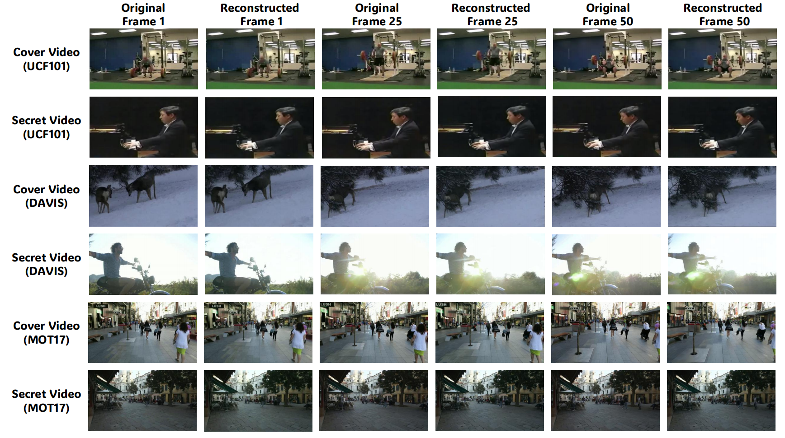

# SemCovert

## Visualization
Example results are available in the [`visualization`](./visualization) directory.


 


## Quick Start
This script provides a quick test for the SemCovert model to embed and reconstruct secret videos.

```bash
python quick_test.py \
  --cover_video_path /path/to/cover_video.mp4 \
  --secret_video_path /path/to/secret_video.mp4 \
  --pre_model_path /path/to/best_model_weights.pth \
  --output_dir ./visual_result \
  --config pre_model_config \
  --batch_size 1 \
  --target_size 256 256 \
  --device cuda
```

## Data & Configuration

### 1. Pretrained Weights
- Place the base **WanVAE** weights in the `preweight/` folder.
- **Important**: If your model architecture differs from the default, update the corresponding network parameters in [`train_config.py`](./train_config.py) and `models/` to match your weights.

### 2. Training Data
- Put your training video files in the `train_data/` folder.
- Alternatively, set a custom path by modifying `data_path` in [`train_config.py`](./train_config.py).

> For other advanced settings, please refer to the comments inside [`train_config.py`](./train_config.py).

## Training

1. Edit [`train_config.py`](./train_config.py) to set your hyperparameters (e.g., learning rate, epochs, output directory).
2. Run the training script:

```bash
python train.py
```

**Notes:**
- All configurations are centralized in `train_config.py`.
- Model checkpoints and logs will be saved to the `output_dir` specified in the config.

## Reproducibility
Scripts to reproduce specific experimental results are provided in the [`Exp`](./Exp) directory. Please refer to the individual files there for detailed training, testing, and evaluation procedures.